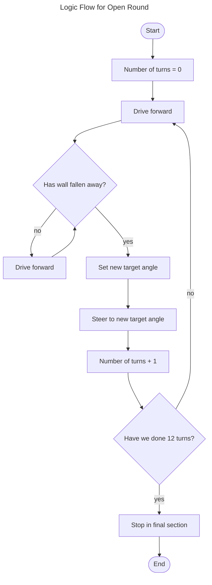

# Robot Documentation

<!-- > Disclaimer! This repo is a fork of the actual repo used so that we could format it nicely -->

- [Robot Documentation](#robot-documentation)
    - [Mobility Management](#mobility-management)
      - [Robot Version 1](#robot-version-1)
      - [Improvements](#improvements)
    - [Power and Sense Management](#power-and-sense-management)
      - [Robot Version 1](#robot-version-1-1)
      - [Improvements](#improvements-1)
    - [Obstacle Management](#obstacle-management)


### Mobility Management
#### Robot Version 1
In the first version of the **'robot'**, the **motors were managed by an [Arduino Nano](/docs/nano.pdf)**. We **communicated with board via [I2C](https://en.wikipedia.org/wiki/I%C2%B2C)**. The main board(a [Pi Pico](/docs/pico.pdf)) sent what speed the motors should be run. The **motor speed was controlled via [PWM](https://en.wikipedia.org/wiki/Pulse-width_modulation)**. High torque low rpm motors were used in the beginning however we ran into issues with the complicated belt system used to drive the wheels. 
 
We then **switched to a lower torque but high rpm brushed dc motor** which was **compatible with an 'off the shelf' gear box**. The motor was also run at a higher than recomended voltage and was **wired with capicitors to reduce EMF**(Which was causing our gyro control board to reset). Steering was handled using another **pi pico with a gyro sensor attached**. This board **controlled a servo using PWM** which controlled the steering rack. The main board communicated(via I2C) the target angle the gyro board should maintain using the steering rack.

The **old chasis** was a combination of 3D printing and hand cut MDF board. The model was a modification(done in Fusion 360) of a base design provided to us by our club. All the control boards as well as the the motor, gear box, servo, gyro, battery and boost converters were **mounted to this chasis**. The TOF sensors used for naviation were mounted to an **mdf frame**(which was connected to the chasis). [Model available here](https://github.com/butterYeeter/Arduino/blob/main/models/body_v2.stl)

<p>
    
    
</p>

#### Improvements
After the provintial round of the competition, a major decision was made to completely redesign the robot. A new chasis was designed(available ```[here](/models/body_v2.stl)```) and is **completely 3D printed**. This helped improve on the flimsy nature of the old MDF frame. **Components** of the old design was **reused** such as the servo for steering as well as the gearbox. The chasis consists of an **interior chasis for mounting components**, steering rack and motors and an **exterior chasis that acts as a bumper**. 

A choice was made to use **2 drive motors**(connected to the same axle) for **increased torque**(initially a decision was made to ram into the walls according to which traffic sign is seen by the camera). Previously **8 [Time of Flight](/docs/tof.pdf) sensors was used** however we then **switched to one fancy 360 degrees scanning lidar**. This is mounted in the center of the chasis and **no other components sit above it to prevent inteference with the measurements**. On top of the lidar, a **```pixy cam``` is mounted on a servo to scan for traffic signs**.

<p></p>


### Power and Sense Management
#### Robot Version 1
The first version of the robot was **powered** using a **3 cell Li-PO battery** however we ran into **issues**. We then **tested using a 2 cell Li-PO** however the **voltage drop** was too great and their were **capacity issues**.  We ulitmately switched to a **6 cell battery in combination with voltage regulators**. 

A variety of sensors were used in this first robot for the challenges. 8 **[Time of Flight](/docs/tof.pdf)** sensors(and one fancy one) as well as a **[BMP 180](/docs/bmp180.pdf)**(the old gyro). These were **managed by 2 [Rasberry Pi Pico's](/docs/pico.pdf)**, one for managing the Time of Flight sensors and one for managing the gyro(BMP 180). The **time of flight sensors detected the distance from the walls** from all sides of the car. The **main board would then request the sensor data** from the Time of Flight board. The gyro board simply used the **BMP 180's output for driving straight** consistently and would accept a **target angle to follow from the main board**.

#### Improvements
The new robot is **powered by a 4 cell battery due to new the chasis**. The previous **6 cell would not fit** within the allocated space on the chasis so we used the **smaller 4 cell**. The 8 time of flight sensors as well as the one fancy time of flight were **discarded in favour of a 360 degree scanning lidar**. The old sensors had a bad field of view and would throw false positives as to what the actual distance reading was. This caused major issues when it came to reliablity of the function of the car. The new lidar has an **excellent field of view of just 2 degrees** and can measure distances of up to 12 meters. This has greatly reduced errors that were associated to the time of flight sensors. We still use a **Pi Pico for managing** this sensor. The sensor uses a basic **one wire serial interface**. Unfortunately there were further issues with dynamic memory allocation as we had to port a library from the Raspberry Pi 4B to the Pi Pico. We finally on 3 good time of flight sensor which are reliable. 

<p align=center>
  
</p>
<p align=center>
  
</p>

Another **issue** we had was **with the old gyro sensor**. Under certain conditions(erratic movement when following a target angle) the **gyro would drift** away from the true angle. This was another major issue that we addressed. We have since **switched to an absolute position sensor**. It is called the **BNO085** which has an **accelerometer, gyrometer and magnotometer**. Through the dark arts of sensor fusion, **gyro drift has been erradicated**. This sensor is managed by its a Pi Pico as well.

### Obstacle Management
For the **open round** the robot **simply uses 2 time of flight sensors** on the left and right of the car and **one gyro**. The gyro **is used to maintain a straight line** while driving as well as **steering** around corners. The **time of flight sensors are used to detect when a wall falls away**(the distance measurement suddenly increases). This can **tell us whether to go clockwise or anti-clockwise** automatically.

<p align=left></p>

For the challenge round the **previous sensors are used in addition to a pixy cam v2**. The pixy cam is **configured to detect the signitures of the traffic signs** and **communicates over I2C whether to go left, right on stay in the middle**(aka no block in the section). When a **signiture is detected** the main board sends a **new target to the gyro board** and **slows down the motor board**.  This is done so that the **robot can 'hug' the correct wall before it passes the traffic sign**. 

